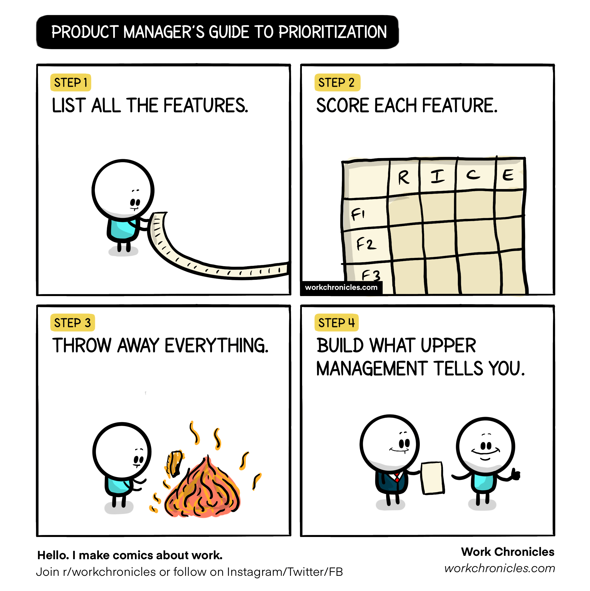
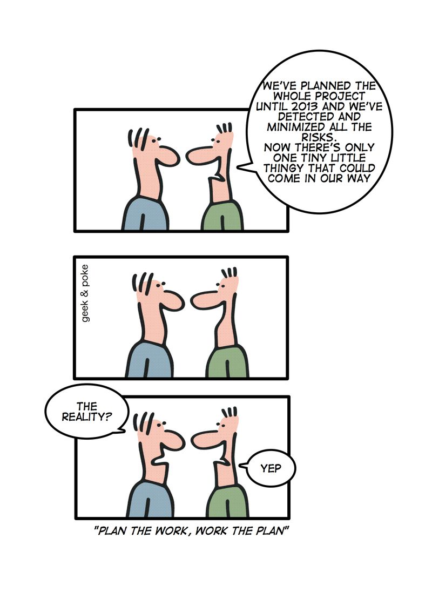

# Core Responsibilities of a Product Manager 🎯

Product managers (PMs) wear many hats and are responsible for guiding a product through every stage of its lifecycle. Understanding the core responsibilities of a PM helps in defining their role, aligning team efforts, and delivering successful products.

---

## Key Responsibilities

### 1. Setting Product Vision and Strategy 🌟

One of the primary responsibilities of a PM is to establish a clear vision and strategy for the product. This includes understanding the market, defining long-term goals, and creating a roadmap that aligns with business objectives.

- **Example**: Defining a vision for a new mobile app to be the go-to solution for fitness tracking in a competitive market.
- **Outcome**: Provides a north star for the team, guiding decision-making and development efforts.

> 💡 **Pro Tip**: When everyone on the team understands the product vision, they’re better equipped to make aligned decisions.

---

### 2. Gathering and Prioritizing Requirements 📋

PMs work closely with stakeholders and users to identify and prioritize product requirements. They prioritize features based on user needs, market demands, and business impact, ensuring that resources are allocated efficiently.

- **Example**: Conducting user interviews to understand pain points and creating a prioritized list of features for the next release.
- **Outcome**: A focused product backlog that addresses the most critical needs.

*"A humorous look at prioritization: sometimes, no matter how thorough the process, upper management has the final say."*  
*Image source: Work Chronicles. Check out more comics at [workchronicles.com](https://www.workchronicles.com/).*

---

### 3. Collaborating with Cross-Functional Teams 🤝

PMs act as the bridge between various departments, including design, engineering, marketing, and sales. Effective collaboration ensures alignment and fosters a collaborative environment.

- **Example**: Working with design to ensure that the user interface aligns with user needs, and with engineering to ensure feasibility.
- **Outcome**: Cohesive teamwork and efficient development.

> 🔄 **Fun Fact**: A good PM is like a universal translator, fluent in both tech jargon and stakeholder-speak!

---

### 4. Managing Product Roadmaps and Timelines 🗓️

Creating and maintaining a product roadmap is a critical responsibility of PMs. They ensure that the roadmap is aligned with strategic goals, updating it as needed to reflect changes in priorities or new insights.

- **Example**: Developing a quarterly roadmap and adjusting timelines based on development progress and feedback.
- **Outcome**: A realistic and flexible plan that guides the team while adapting to new information.

*"We've planned everything down to the smallest detail—what could go wrong?"*  
*This comic is over 10 years old (from 2010), but it's still as accurate as ever! Image source: Geek & Poke.*

---

### 5. Analyzing and Leveraging Data 📊

Data-driven decision-making is central to effective product management. PMs use analytics to understand user behavior, track product performance, and identify areas for improvement.

- **Example**: Monitoring user engagement metrics to determine the effectiveness of a new feature and make adjustments as necessary.
- **Outcome**: Informed decisions that enhance the user experience and optimize product performance.

> 🔍 **Joke**: "Vanity Metrics: The glittery data points that make your boss happy but your users indifferent."

---

### 6. Communicating with Stakeholders 📢

PMs communicate with stakeholders across the organization to keep them informed about the product’s progress, challenges, and successes. This includes executives, team members, and sometimes even customers.

- **Example**: Presenting a quarterly update to executives on product progress, user feedback, and upcoming initiatives.
- **Outcome**: Stakeholder alignment and support for the product’s direction.

> 🗣️ **Pro Tip**: A well-prepared PM can answer any question with "It’s on the roadmap" (just don’t specify which roadmap).

---

## Conclusion

The core responsibilities of a product manager involve setting a clear vision, aligning cross-functional teams, and making data-informed decisions.