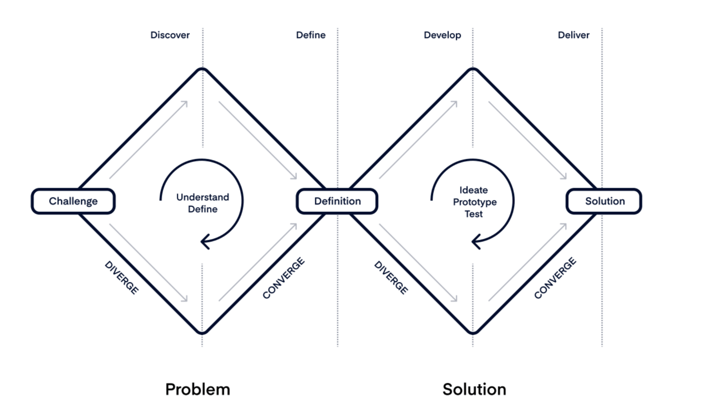

# Overview of Product Management 📋

Product management is the strategic process of guiding a product from conception through its lifecycle, ensuring that it meets user needs and aligns with business goals. Product managers (PMs) play a key role in defining what gets built, why it matters, and how it drives value for users and the organization.

## The Product Management Process

Product management is a continuous journey that involves understanding problems, exploring potential solutions, and delivering value. The **Double Diamond Framework** provides a structured approach to this process, dividing it into stages of **problem discovery** and **solution development**.

*The Double Diamond Framework emphasizes exploring and refining both problems and solutions in a structured, iterative approach.*  
*Image source: Productboard*

In this framework, the product management process is divided into four key stages:

1. **Discover**: Engage in open-ended conversations with core personas to gather unfiltered insights, avoiding preconceived notions.
2. **Define**: Analyze collected information to identify and prioritize key problem areas, ensuring alignment with user needs and business objectives.
3. **Develop**: Generate a range of potential solutions, encouraging creative collaboration among team members.
4. **Deliver**: Test and refine the chosen solution, implementing it effectively to meet user needs and achieve desired outcomes.

By using this framework, product managers can approach development in a way that encourages continuous learning and improvement, with a focus on refining and validating ideas at each step.

---

## Key Responsibilities of a Product Manager

Product managers are responsible for setting a clear product vision, defining strategy, prioritizing features, and working cross-functionally to bring products to life. Some of their core responsibilities include:
- **Setting Product Vision and Strategy**
- **Gathering and Prioritizing Requirements**
- **Collaborating with Cross-Functional Teams**
- **Managing Roadmaps and Timelines**
- **Analyzing and Leveraging Data**

---

Product management combines elements of strategy, user empathy, and leadership. By balancing user needs with business objectives, PMs create impactful products that achieve market success.

    <a href="/docs/1-foundations-of-product-management/index" class="btn btn-secondary">👈 Back to Index</a>
    <a href="/docs/1-foundations-of-product-management/core-responsibilities" class="btn btn-primary">Next: Core Responsibilities 👉</a>

