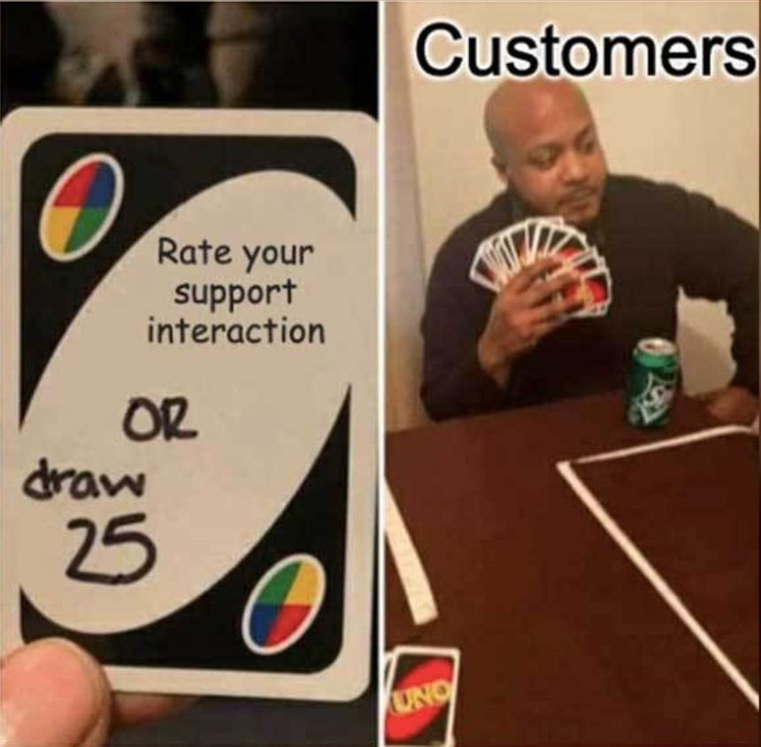

# Customer Interviewing and Feedback Loops 🗣️

Understanding your customers is the cornerstone of product discovery. **Customer interviews** and **feedback loops** provide the insights you need to build products that truly address user needs. In this section, we’ll explore how to conduct effective interviews and set up continuous feedback loops to guide your product decisions.

---

## Why Customer Interviews Matter

1. **Uncover Hidden Needs**:  
   Customers may not always articulate their pain points directly. Interviews help you dig deeper to understand their true needs.

2. **Validate Assumptions**:  
   Testing your assumptions with real users ensures you’re on the right track and avoids costly missteps.

3. **Guide Product Iterations**:  
   Customer feedback informs product changes, helping you build solutions that genuinely resonate with users.

---

## Best Practices for Customer Interviews

Conducting customer interviews effectively requires preparation and strategy. Here’s a checklist to get you started:

### Customer Interview Checklist ✅
- **Prepare Questions**: Focus on open-ended questions that encourage detailed responses (e.g., “Can you tell me about a time when…?”).  
- **Avoid Leading Questions**: Keep your questions neutral to avoid biasing the customer’s response.  
- **Listen Actively**: Pay attention to what the customer is saying (and not saying). Body language and tone can provide additional insights.  
- **Take Notes or Record**: Always document the conversation to review later. Tools like Otter.ai or Zoom can help with transcription.  
- **Thank the Customer**: Make sure to show appreciation for their time and input.  

> 💡 **Pro Tip**: Ask follow-up questions like “Why?” or “Can you elaborate?” to uncover the deeper reasons behind their answers.

---

## Setting Up Feedback Loops

A **feedback loop** is a system for continuously gathering and acting on user feedback. Here’s how to set one up:

1. **Choose the Right Tools**:  
   Use surveys (e.g., Typeform), in-app feedback widgets, or analytics tools (e.g., Google Analytics, Mixpanel) to collect user insights.

2. **Encourage Open Feedback**:  
   Create an environment where customers feel comfortable sharing honest feedback.  
   

    
   

   *"When you ask a customer to fill out a feedback survey, and they choose to draw 25 cards instead."* 😅  
   Encouraging feedback can sometimes feel like pulling teeth—but it’s worth it when you start seeing the insights roll in.

3. **Act on Feedback Quickly**:  
   Don’t let valuable feedback sit idle. Turn insights into actions by prioritizing changes that address the most critical user needs.

4. **Close the Loop**:  
   Inform customers about how their feedback was implemented. This builds trust and encourages further participation.

---

## Practical Example: How Feedback Loops Improve Products

Imagine launching a new feature that users find confusing. Instead of waiting for churn data to show the issue, set up a **feedback loop** using an in-app survey to ask, “What could make this feature easier to use?”  

By acting on feedback quickly, you can:
- Iterate on the design to improve usability.
- Boost user satisfaction and adoption rates.
- Build trust by showing customers their voices are heard.

---

## Conclusion

Customer interviews and feedback loops are essential tools for understanding user needs and iterating effectively. By embedding these practices into your discovery process, you ensure your product evolves based on real customer insights.

Next, let’s explore **Prototyping and Hypothesis Testing**, where we’ll turn these insights into actionable experiments.

    <a href="/docs/2-product-discovery-and-customer-insights/opportunity-mapping-and-prioritization" class="btn btn-secondary">👈 Previous: Opportunity Mapping and Prioritization</a>
    <a href="/docs/2-product-discovery-and-customer-insights/prototyping-and-hypothesis-testing" class="btn btn-primary">Next: Prototyping and Hypothesis Testing 👉</a>

