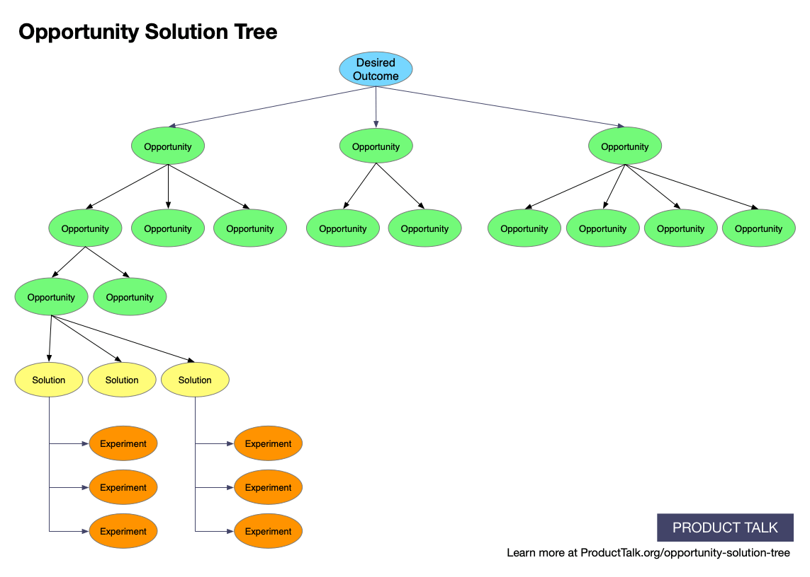

# Introduction to Product Discovery 🔍

Product discovery is the process of continuously learning about your customers—understanding their needs, pain points, and desires—so you can build products that truly add value. This chapter covers the essential techniques, tools, and frameworks that guide discovery, with a focus on **Opportunity Solution Trees** (OSTs) to structure your approach.

---

## Why Product Discovery Matters

### 1. Solve the Right Problems 🎯
Discovery helps you avoid the trap of building features no one needs by focusing on solving real problems for your users.

### 2. Reduce Risk 🚧
By validating ideas early, you save time and resources, preventing costly missteps during development.

### 3. Foster Customer-Centricity 🧠
Great products are built by teams that continuously listen to their customers, adapt, and learn.

> 💡 **Pro Tip**: Discovery isn’t a one-time event—it’s an ongoing process that evolves with your product and customers.

---

## The Role of Opportunity Solution Trees in Product Discovery

An **Opportunity Solution Tree (OST)** is a framework that helps product teams systematically link customer problems to potential solutions and experiments. It provides structure and clarity in the discovery process.

### The Structure of an Opportunity Solution Tree

1. **Desired Outcome (Root)**:  
   The goal you're working towards, such as "Increase user engagement" or "Reduce churn."

2. **Opportunities (Branches)**:  
   Identified customer needs or pain points that need to be addressed to achieve the desired outcome.

3. **Solutions (Sub-branches)**:  
   Potential solutions for each identified opportunity, generated through brainstorming or ideation.

4. **Experiments (Leaves)**:  
   Tests (e.g., A/B tests, prototypes, user interviews) to validate or invalidate the proposed solutions.

---

## The Discovery Process

Product Discovery is not a one-off phase but a continuous cycle that integrates with product delivery. Here's how it fits together:

1. **Map Opportunities**:  
   Use customer feedback and research to uncover problems and group them into themes.

2. **Generate Solutions**:  
   For each opportunity, brainstorm and generate potential solutions, linking them to customer pain points.

3. **Test and Learn**:  
   Validate solutions by testing them with customers. This could involve prototypes, experiments, or feedback loops.

  
*Opportunity Solution Trees help visualize how opportunities, solutions, and experiments connect.*

---

## How Discovery Fits into Product Development

Discovery and delivery should run in parallel. Teams that embrace **continuous discovery** are able to:

- Learn faster by iterating on customer feedback.
- Reduce waste by avoiding solutions that don’t work.
- Deliver value sooner by aligning discovery with delivery efforts.

---

## What’s Next?

Now that you understand the importance of product discovery and Opportunity Solution Trees, let’s explore how to make discovery a continuous practice in [Continuous Discovery](continuous-discovery). 🔄

    <a href="../2-product-discovery-and-customer-insights/index" class="btn btn-secondary">👈 Back to Overview</a>
    <a href="../2-product-discovery-and-customer-insights/continuous-discovery" class="btn btn-primary">Next: Continuous Discovery 👉</a>

