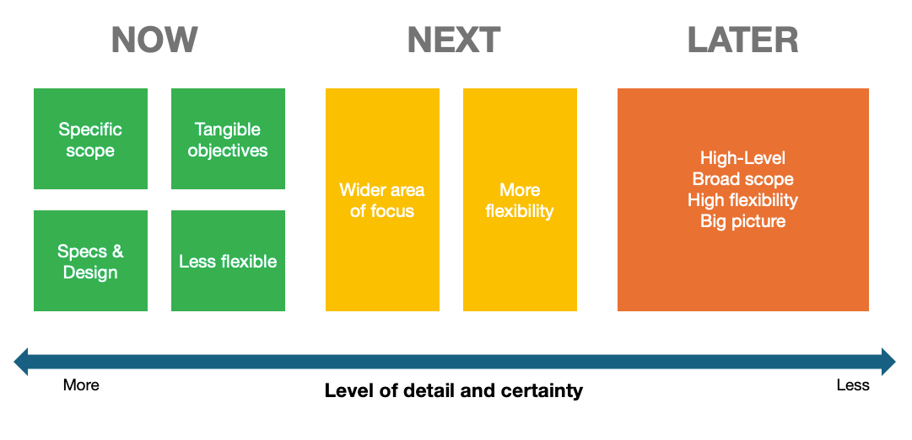

# Now-Next-Later Framework 🕒

The **Now-Next-Later** framework is a simple and flexible way to organize roadmap priorities by time horizons. It enables teams to balance short-term execution with long-term planning, ensuring focus on the most impactful tasks while adapting to change.

*The Now-Next-Later framework helps teams manage priorities without overcommitting to rigid timelines.*

---

## What is the Now-Next-Later Framework?

This framework breaks down priorities into three distinct time horizons:

- **Now**: Work currently in progress, with a well-defined scope and high certainty.
- **Next**: Near-term priorities that are in planning but remain flexible.
- **Later**: Long-term ideas that are loosely defined and exploratory.

> 💡 **Why it works**: The framework balances clarity and adaptability, enabling teams to manage both short-term execution and long-term vision.

---

## Breaking Down the Time Horizons

### 1. Now 🟩
   - **Characteristics**:
     - Specific, actionable tasks with detailed requirements.
     - High certainty and low flexibility.
   - **Examples**:
     - Finalizing feature implementation.
     - Fixing critical bugs.
   - **Mindset**: *"Let’s deliver this!"*

### 2. Next 🟨
   - **Characteristics**:
     - Defined but flexible priorities.
     - Wider areas of focus than “Now.”
   - **Examples**:
     - Researching potential solutions for upcoming features.
     - Preparing designs or prototypes.
   - **Mindset**: *"What’s coming up next?"*

### 3. Later 🟧
   - **Characteristics**:
     - High-level ideas with minimal detail.
     - Maximum flexibility and low certainty.
   - **Examples**:
     - Exploring new market opportunities.
     - High-level planning for product extensions.
   - **Mindset**: *"On the horizon."*

---

## Benefits of the Now-Next-Later Framework

- **Clarity**: Provides a clear distinction between immediate, near-term, and long-term priorities.
- **Flexibility**: Allows teams to adjust focus as priorities evolve.
- **Stakeholder Alignment**: Simple to communicate, making it easier to align everyone on what’s happening now and what’s planned for the future.
- **Focus on Value**: Ensures that the team is always working on the most impactful tasks.

---

## How to Implement the Framework

1. **Define Your “Now”**
   - List tasks and initiatives that are currently in progress and have a high level of detail.
   - Ensure that the team is actively working on these items.

2. **Plan the “Next”**
   - Identify the priorities that will be tackled once “Now” items are completed.
   - Maintain some flexibility for adjustments based on new insights.

3. **Explore the “Later”**
   - Use the “Later” section to capture long-term ideas and opportunities.
   - Avoid overloading this section with unnecessary details—keep it high-level.

4. **Review Regularly**
   - Update the framework frequently to reflect changing priorities and evolving business needs.
   - Move items from “Next” to “Now” and from “Later” to “Next” as they gain clarity.

---

## Common Pitfalls and How to Avoid Them

1. **Overloading the “Later” Section**
   - Pitfall: Adding too many items that dilute focus.
   - Solution: Keep “Later” lean, focusing on the most promising long-term ideas.

2. **Under-Defining the “Now” Section**
   - Pitfall: Including vague tasks that aren’t ready for action.
   - Solution: Ensure that “Now” items are well-defined and actionable.

3. **Ignoring Stakeholder Feedback**
   - Pitfall: Using the framework as a siloed team tool without external input.
   - Solution: Involve stakeholders to validate priorities and ensure alignment.

---

## When to Use the Now-Next-Later Framework

This framework is ideal for:
- Teams working in fast-paced environments with shifting priorities.
- Roadmaps that need flexibility without losing focus.
- Stakeholders who prefer a high-level, time-based view of priorities.

---

## Conclusion

The Now-Next-Later framework is a practical and adaptable approach for managing roadmap priorities. By balancing clarity with flexibility, it helps teams focus on delivering immediate value while keeping long-term goals in sight.

    <a href="/docs/4-roadmapping-and-planning/aligning-roadmaps-with-vision-and-bets" class="btn btn-secondary">👈 Previous: Aligning Roadmaps with Vision and Bets</a>
    <a href="/docs/4-roadmapping-and-planning/prioritization-and-sequencing" class="btn btn-primary">Next: Prioritization and Sequencing 👉</a>

