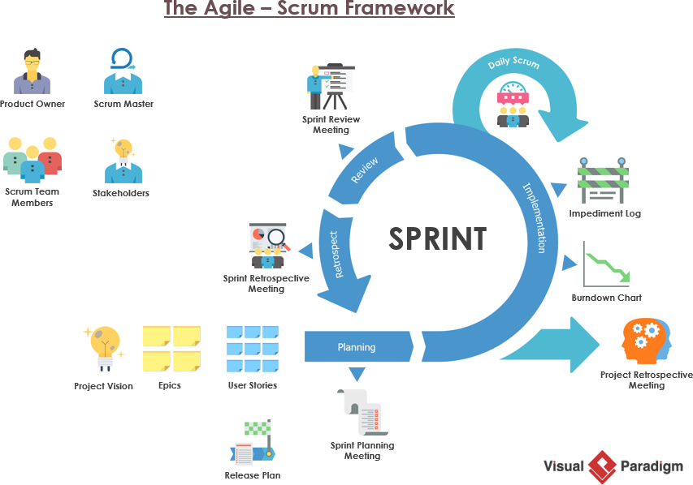
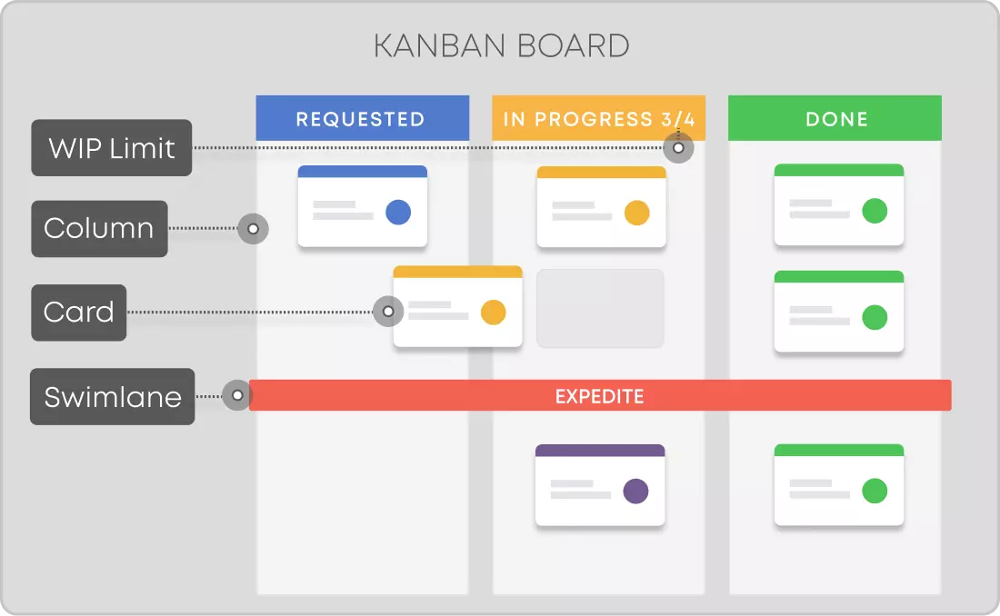

# Agile Framework 🔄

The **Agile Framework** is a widely adopted approach to product development, emphasizing iterative delivery, team collaboration, and responsiveness to change. Agile empowers teams to adapt to evolving requirements and deliver value efficiently by breaking work into smaller, manageable increments.

---

## What is Agile?

Agile is a mindset that prioritizes:
1. **Individuals and Interactions** over processes and tools.
2. **Working Software** over comprehensive documentation.
3. **Customer Collaboration** over contract negotiation.
4. **Responding to Change** over following a plan.

Introduced in the **Agile Manifesto (2001)**, Agile has spawned multiple methodologies, the most prominent being **Scrum**.

---

## Scrum: Iteration-Based Agile Framework

**Scrum** divides work into fixed-length iterations called **sprints** (2–4 weeks), delivering small increments of value. It provides structure through defined roles, ceremonies, and artifacts.

### Key Roles in Scrum

- **Product Owner**: Prioritizes the product backlog and ensures work aligns with customer needs.
- **Scrum Master**: Facilitates the process and removes impediments.
- **Development Team**: Cross-functional professionals responsible for delivering the sprint increment.

### Scrum Ceremonies

1. **Backlog Refinement**  
   - Regularly updating and prioritizing backlog items to ensure clarity and readiness for future sprints.

2. **Sprint Planning**  
   - Setting the sprint goal and defining backlog items for the sprint.

3. **Daily Scrum (Standup)**  
   - A quick 15-minute check-in meeting to align on progress and address blockers.

4. **Sprint Review**  
   - Demonstrating the product increment to stakeholders and gathering feedback for future iterations.

5. **Sprint Retrospective**  
   - Reflecting on the sprint and identifying actionable improvements for team processes.

---

## Scrum Workflow

The Scrum process is a continuous cycle of delivering value through the following steps:

1. **Backlog Refinement**  
   - Ensures tasks are clearly defined, prioritized, and ready for development.

2. **Sprint Planning**  
   - Defines the sprint backlog and sets a clear goal for the sprint.

3. **Sprint Execution**  
   - Development work is carried out with regular daily scrums for alignment.

4. **Increment Delivery**  
   - The potentially shippable product increment is completed during the sprint.

5. **Sprint Review**  
   - Demonstrates the product increment to stakeholders for feedback.

6. **Sprint Retrospective**  
   - Reflects on the team’s process and identifies actionable improvements for future sprints.

  
*Source: [Visual Paradigm](https://www.visual-paradigm.com/scrum/what-are-scrum-ceremonies/)*

---

## Kanban: Flow-Based Agile Workflow

**Kanban** is a visual system for managing workflows, focusing on limiting work-in-progress (WIP) to optimize efficiency and prevent bottlenecks.

### Key Elements of Kanban

1. **Workflow Visualization**: A Kanban board displays tasks in stages (e.g., To Do, In Progress, Done).

2. **WIP Limits**: Caps the number of tasks that can be in progress simultaneously.

3. **Continuous Delivery**: Unlike Scrum, Kanban is not time-boxed but focuses on continuous flow.

  
*Source: [Kanbanize](https://kanbanize.com/kanban-resources)*

---

## Benefits of Agile

- **Faster Delivery**: Incremental improvements shorten time-to-market.
- **Customer-Centricity**: Frequent feedback ensures alignment with user needs.
- **Team Collaboration**: Emphasizes shared ownership and open communication.
- **Flexibility**: Adapts easily to changing priorities.

---

## Common Challenges

1. **Cultural Resistance**: Transitioning to Agile requires a mindset shift.
2. **Scope Creep**: Without strong backlog management, flexibility can lead to uncontrolled changes.
3. **Misunderstanding Roles**: Lack of clarity around roles can disrupt team dynamics.

---

## Want to Learn More?

Visit [Scrum.org](https://www.scrum.org) for in-depth information on Scrum and [Kanbanize](https://kanbanize.com) to dive deeper into Kanban workflows.

---

## Conclusion

The Agile Framework revolutionized product development by promoting collaboration, flexibility, and iterative improvement. Whether adopting Scrum or Kanban, Agile empowers teams to build products that deliver value faster and adapt to changing needs.

    <a href="/docs/5-product-development-frameworks-and-execution/introduction-to-product-development-frameworks" class="btn btn-secondary">👈 Previous: Introduction to Product Development Frameworks</a>
    <a href="/docs/5-product-development-frameworks-and-execution/waterfall-methodology" class="btn btn-primary">Next: Waterfall Methodology 👉</a>

