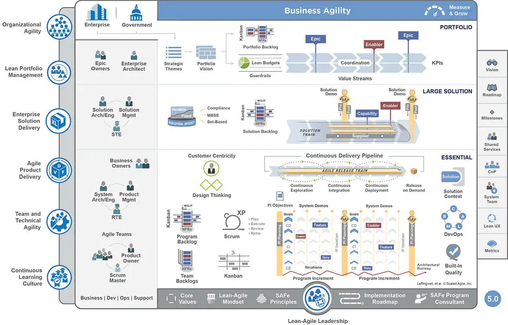

# Scaled Agile Framework (SAFe) 🏢

The **Scaled Agile Framework (SAFe)** is a methodology designed to scale Agile practices across large organizations. While it promises to bring alignment and efficiency to complex systems, SAFe has faced significant criticism for being overly bureaucratic and contrary to core Agile principles.

---

## What is SAFe?

SAFe is built on core Agile principles but introduces additional layers of structure to address the challenges of scaling Agile in enterprises. It incorporates elements from Agile, Lean, and DevOps, and focuses on improving collaboration and alignment across teams.

---

## Key Components of SAFe

1. **Lean-Agile Leadership**  
   - Leaders foster collaboration, continuous learning, and adaptability.

2. **Program Increment (PI) Planning**  
   - A time-boxed event where all teams align on objectives, dependencies, and deliverables for the next increment (typically 8–12 weeks).

3. **Agile Release Trains (ARTs)**  
   - A virtual team of teams (50–125 people) that plans, commits, and executes work together in synchronized iterations.

4. **Portfolio Management**  
   - Aligns strategic goals with execution by managing budgets, objectives, and initiatives.

5. **Continuous Delivery Pipeline**  
   - A workflow for continuous exploration, integration, and deployment to deliver value more effectively.

---

## One of the many diagrams that explain SAFe – the Scaled Agile Framework

---

## Criticisms of SAFe

- **Overhead and Complexity**: The additional layers of structure can slow decision-making and reduce agility.
- **Not "True Agile"**: Critics argue SAFe compromises Agile principles in favor of hierarchical control.
- **High Implementation Costs**: Requires significant training, buy-in, and ongoing management to be effective.

> **Joke**: The SAFe acronym should replace its meaning to **"Slow Annoying Framework for Everyone"**. 😄  

---

## Want to Learn More?

For more detailed insights (or to decide whether to avoid it entirely), visit:
- [Scaled Agile Framework Official Website](https://www.scaledagileframework.com)
- [SAFe Overview on Atlassian](https://www.atlassian.com/agile/scaled-agile-framework)

---

## Conclusion

SAFe claims to help organizations scale Agile across enterprises but often ends up scaling complexity and bureaucracy instead. While it can align large teams, the compromises it introduces may outweigh the benefits. For many, true agility lies in simpler, less hierarchical alternatives.

    <a href="../5-product-development-frameworks-and-execution/waterfall-methodology" class="btn btn-secondary">👈 Previous: Waterfall Methodology</a>
    <a href="../5-product-development-frameworks-and-execution/user-stories" class="btn btn-primary">Next: User Stories 👉</a>

