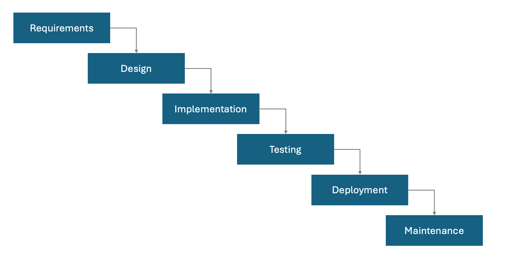

# Waterfall Methodology 🌊 (Outdated but Not Forgotten)

The **Waterfall Methodology** is a traditional, sequential approach to product development that gained popularity in the mid-20th century. While once widely used, it has largely fallen out of favor in the modern, fast-paced world of iterative and Agile methodologies. Its rigidity and emphasis on upfront planning make it ill-suited for projects with evolving requirements or significant uncertainty.

---

## What is Waterfall?

Waterfall is a **linear process** where each phase must be completed before moving on to the next. Its structure relies on the assumption that all requirements can be defined accurately upfront—a rarity in today’s complex and dynamic environments.

---

## Key Phases of Waterfall

1. **Requirements Gathering**  
   - Exhaustive documentation of requirements upfront, often without feedback loops.

2. **Design**  
   - Detailed design specifications that assume no deviation from the original requirements.

3. **Implementation (Development)**  
   - Developers code strictly to the predefined design, with limited room for adjustment.

4. **Testing**  
   - Testing occurs after development is completed, often uncovering issues late in the process.

5. **Deployment**  
   - The final product is delivered as a monolithic release, sometimes years after work begins.

6. **Maintenance**  
   - Ongoing bug fixes and updates are handled, but significant changes are often impractical.

---

## Why Waterfall is Outdated

- **Rigid Structure**: Assumes a perfect understanding of requirements at the start, which is rarely achievable.  
- **Delayed Feedback**: Stakeholder input is limited until the product is nearly complete, leading to mismatches between expectations and outcomes.  
- **High Risk of Failure**: A single error in the early stages can cascade into significant delays and cost overruns.  
- **Inefficiency**: Sequential processes can result in unnecessary delays, especially when issues are discovered late.  
- **Poor Fit for Software**: Modern software development thrives on flexibility, making Waterfall incompatible with iterative practices like Agile or Lean.  

> **Pro Tip**: Breaking Waterfall into smaller pieces doesn’t make it Agile. It’s still just broken Waterfall. 🚧

---

## Waterfall steps

---

## Advantages (Rare but Possible)

While rarely the best option, Waterfall might still work in:
- **Static Requirements**: Projects with unchanging and well-defined requirements.  
- **Regulatory Environments**: Where detailed documentation and adherence to strict processes are mandatory.  
- **Predictable Outputs**: Industries like construction or manufacturing, where change is costly and undesirable.

---

## Want to Learn More?

For additional information, check out:
- [Waterfall Project Management Basics](https://www.smartsheet.com/blog/waterfall-project-management)  
- [Waterfall in Software Development](https://www.visual-paradigm.com/features/waterfall-model/)

---

## Conclusion

The Waterfall Methodology, while historically significant, is largely considered a relic in modern product management. Its rigid structure and delayed feedback loops make it unsuitable for the fast-changing, iterative nature of today’s digital products. Though there are niche use cases where Waterfall might apply, most teams are better served by Agile or other flexible approaches.

    <a href="../5-product-development-frameworks-and-execution/agile-framework" class="btn btn-secondary">👈 Previous: Agile Framework</a>
    <a href="../5-product-development-frameworks-and-execution/scaled-agile-framework" class="btn btn-primary">Next: Scaled Agile Framework (SAFe) 👉</a>

