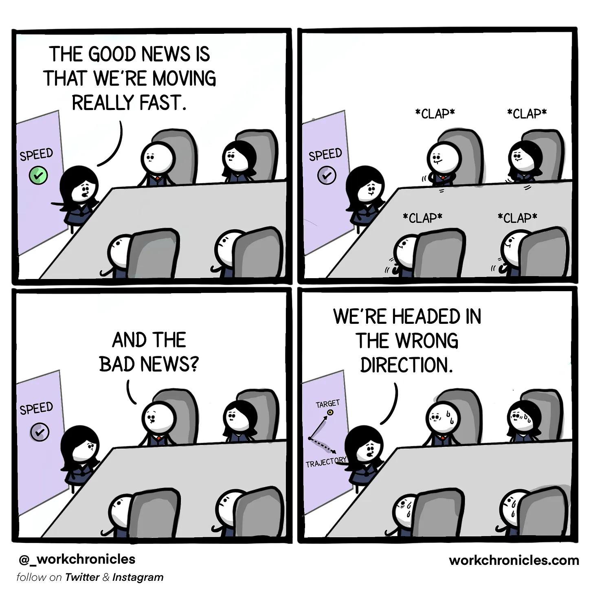

# Defining Success Metrics 🎯

Success metrics are essential for understanding whether your product delivers value and aligns with its goals. Without clear metrics, teams risk making decisions based on assumptions rather than data, leading to inefficiencies and missed opportunities.

---

## Why Define Success Metrics?

Success metrics:
- **Provide Clarity**: Help teams and stakeholders understand what success means for the product.
- **Drive Alignment**: Ensure everyone is working toward the same goals.
- **Enable Measurement**: Allow teams to track progress and evaluate the impact of their efforts.
- **Support Decision-Making**: Help identify what’s working and where improvements are needed.

---

## Steps to Define Success Metrics

1. **Start with the Product Vision**  
   - Your metrics should align with the product's overarching vision and strategy.

2. **Identify Key Objectives**  
   - What outcomes are you trying to achieve? Examples include increasing user engagement, reducing churn, or driving revenue.

3. **Define Measurable Outcomes**  
   - Translate objectives into specific, quantifiable metrics. For example:
     - Objective: Increase engagement.  
     - Metric: Daily active users (DAUs) or average session duration.

4. **Validate Metrics**  
   - Ensure your metrics meet the following criteria:
     - **Actionable**: Can you take action based on this metric?  
     - **Trackable**: Can the metric be measured reliably?  
     - **Meaningful**: Does it reflect progress toward your goals?

5. **Prioritize Metrics**  
   - Focus on the metrics that matter most. Avoid tracking too many, as it can dilute focus and create noise.

---

  
*Source: [Work Chronicles](https://workchronicles.com)*

---

## Common Pitfalls

- **Vanity Metrics**: Numbers that look impressive but don’t reflect meaningful progress (e.g., raw download counts).  
- **Misaligned Metrics**: Metrics that don’t align with product goals or customer value.  
- **Over-Reliance on a Single Metric**: Focusing on one metric can lead to blind spots and unintended consequences.

> **Example**: Optimizing only for DAUs might lead to spamming users with notifications, harming long-term retention.

---

## Want to Learn More?

For deeper insights, check out:
- [Measure What Matters](https://www.measurewhatmatters.com)  
- [Lean Analytics](https://leananalyticsbook.com)  

---

## Conclusion

Defining success metrics is the foundation of a data-driven product culture. By focusing on clear, actionable metrics, teams can align around shared goals and make decisions that drive meaningful outcomes.

    <a href="../6-metrics-measurement-and-success/index" class="btn btn-secondary">👈 Previous: Metrics, Measurement, and Success</a>
    <a href="../6-metrics-measurement-and-success/types-of-metrics" class="btn btn-primary">Next: Types of Metrics 👉</a>

